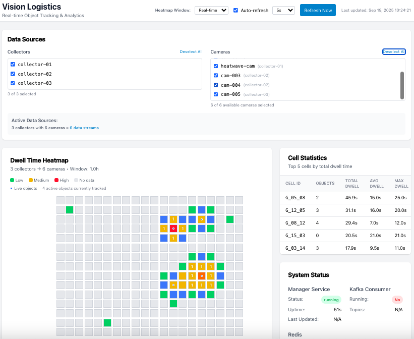
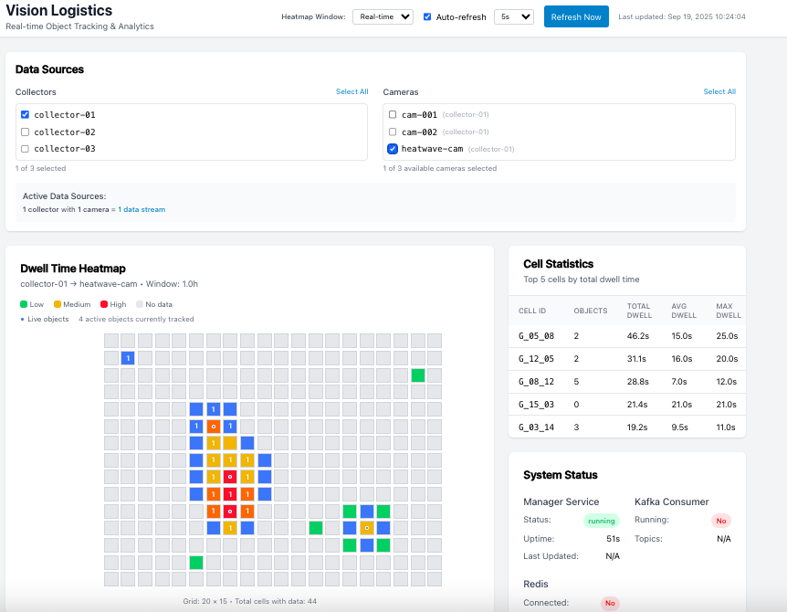

# Vision Logistics Tracking System

> **Real-time warehouse logistics tracking with live animated heatmaps**

## The Purpose Behind Development

"You might notice this repo is a bit of an outlier compared to my other work. It actually started after a friend of mine, who runs a startup, vented to me about some issues. The problem is, my current setup is basically a dinosaur—it can't even handle running Kafka. I know I desperately need a new laptop or desktop, but I'm still sitting here agonizing over what to buy."

## **Quick Start**

```bash
git clone <repository-url>
cd vision-logistics
npm start
```

## Demo



**🌐 Open http://localhost:3000** to see:
- **Live animated heatmap** with 4 moving objects
- **Real-time statistics** and object tracking
- **Event log** showing live warehouse activity

### ** What You'll See**

-  **Forklift**: Horizontal movement across warehouse floor
-  **Worker**: Diagonal movement through work zones
-  **Pallet**: Circular movement around storage area
-  **Cart**: Vertical movement in transport corridors
-  **15-second animation cycles** with auto-refresh

## **System Architecture**

```
🎥 Cameras → 📡 Collectors → 🗄️ Redis → 🧮 Manager → 📊 Analytics
                                ↑                      ↓
                              Queue                🌐 UI ← APIs
```

| Service | Purpose | Port |
|---------|---------|------|
| **Collector** | Process camera feeds | 3001 |
| **Manager** | Calculate dwell times | 3002 |
| **UI** | Live analytics dashboard | 3000 |

## **Features**

- **20×15 Grid System**: 300 trackable warehouse cells
- **Live Heatmaps**: Visual intensity mapping with animations
- **Real-time Updates**: Auto-refresh every 30 seconds
- **Interactive**: Click cells for detailed information
- **Cross-platform**: Windows, macOS, Linux support

## **Troubleshooting**

**Connection errors?**
```bash
npm run fix-and-start
```

**Common issues:**
- **Port conflicts**: `killall node && npm start`
- **No Docker**: `npm run start:fallback`
- **No data**: `npm run generate-test-data`

## **Documentation**

- **[Demo Guide](./docs/DEMO_GUIDE.md)** - Presentation and demonstration guide
- **[Practice Guide](./docs/PRACTICE_GUIDE.md)** - Learning exercises and tutorials
- **[Troubleshooting](./docs/TROUBLESHOOTING.md)** - Complete troubleshooting reference

## **API Examples**

```bash
# Get live heatmap data
curl "http://localhost:3002/heatmap"

# Get active objects
curl "http://localhost:3002/objects/active"

# Get recent events
curl "http://localhost:3002/events/recent"

# Generate test data
curl -X POST http://localhost:3001/generate-test-frame \
  -H "Content-Type: application/json" \
  -d '{"camera_id": "cam-001", "object_count": 5}'
```

## **Use Cases**

- **Warehouse Management**: Track pallet movements and storage times
- **Logistics Centers**: Monitor package flow and processing times
- **Construction Sites**: Track equipment utilization and idle times
- **Retail Operations**: Customer movement and dwell time analysis

## License
This project is dual-licensed under the GNU 3.0 License and a Commercial License.
- GNU 3.0 License: Free for open source and personal use
- Commercial License: Required for commercial use, available via separate agreement
Contact: your-email@example.com
